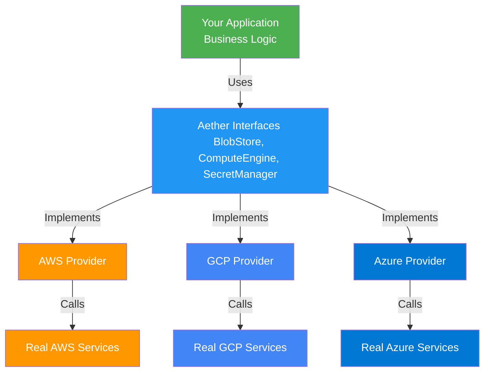
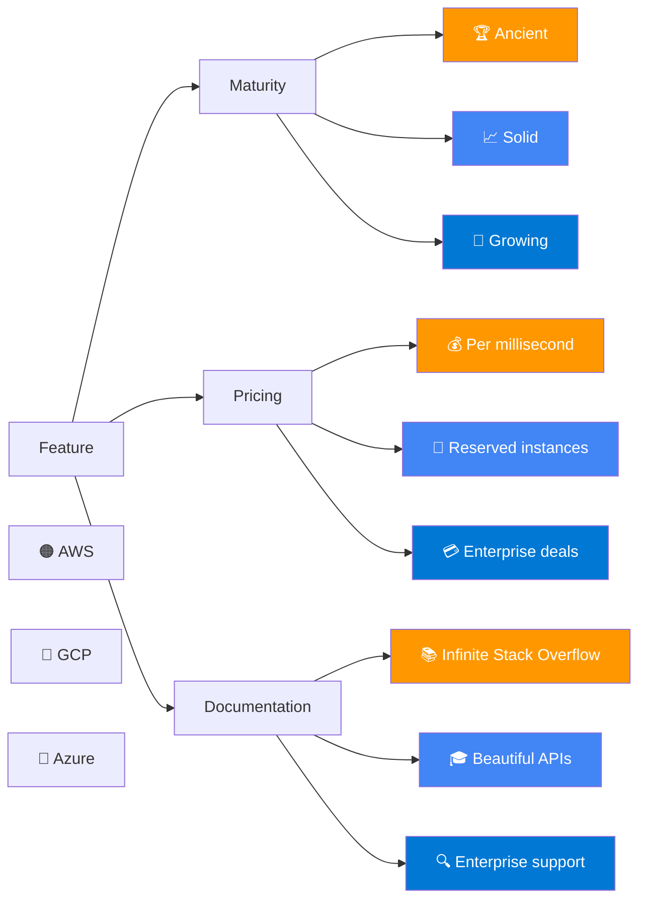
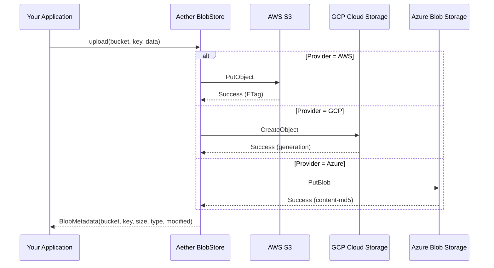
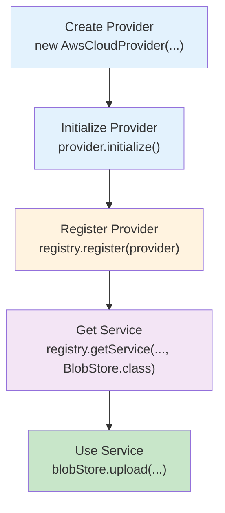
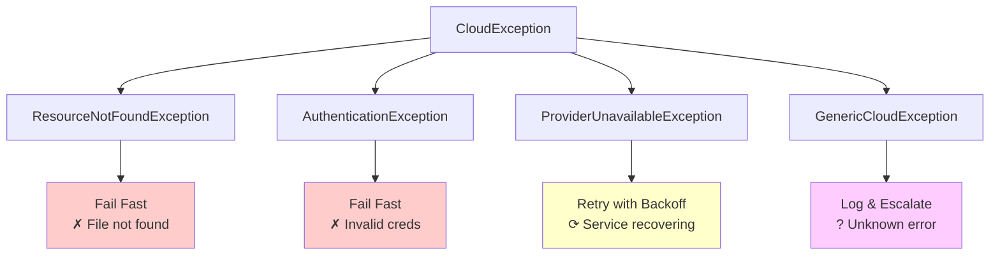

# Aether Architecture: Multi-Cloud Abstraction

Aether provides a unified, cloud-agnostic API for multi-cloud applications. Write business logic once, deploy to AWS, GCP, Azure without code changes.

## Core Philosophy



**Key Insight**: Your application depends on Aether interfaces, not cloud SDKs. Swap providers at runtime with zero business logic changes.

## Service Interfaces

### BlobStore

Unified API for object/blob storage.

| Operation | Purpose |
|---|---|
| `upload(request)` | Store a file/object |
| `download(ref)` | Retrieve a file/object |
| `list(request)` | List objects with prefix filtering |
| `getMetadata(ref)` | Get size, content-type, modified time |
| `exists(ref)` | Check if object exists |
| `delete(ref)` | Remove an object |

**Implementations**:
- 🟠 AWS: `AwsS3BlobStore` → S3
- 🔵 GCP: `GcsBlobStore` → Cloud Storage
- 🔷 Azure: `AzureBlobStoreService` → Blob Storage

### ComputeEngine

Unified API for virtual machine provisioning.

| Operation | Purpose |
|---|---|
| `createInstance(config)` | Launch a VM |
| `getInstance(id)` | Get instance details |
| `listInstances()` | List all instances |
| `terminateInstance(id)` | Stop and delete a VM |

**Implementations**:
- 🟠 AWS: `AwsEc2ComputeEngine` → EC2
- 🔵 GCP: `GceComputeEngine` → Compute Engine
- 🔷 Azure: `AzureVmComputeEngine` → Virtual Machines

### SecretManager

Unified API for credential/secret storage with versioning.

| Operation | Purpose |
|---|---|
| `createSecret(id, value)` | Store a secret |
| `getSecret(id)` | Retrieve a secret by id |
| `updateSecret(id, value)` | Change secret value |
| `rotate(id)` | Generate new version (user owns rotation logic) |
| `deleteSecret(id)` | Remove a secret |
| `listSecrets()` | List all secrets |

**Implementations**:
- 🟠 AWS: `AwsSecretsManager` → Secrets Manager
- 🔵 GCP: `GcpSecretManager` → Secret Manager
- 🔷 Azure: `AzureKeyVaultSecretManager` → Key Vault

## Module Structure

```
aether/
├── aether-core/           ← Interfaces, exceptions, models
├── aether-aws/            ← AWS provider (S3, EC2, Secrets Manager)
├── aether-gcp/            ← GCP provider (Cloud Storage, Compute Engine, Secret Manager)
├── aether-azure/          ← Azure provider (Blob Storage, Virtual Machines, Key Vault)
├── aether-inmemory/       ← Test implementations (in-memory, thread-safe)
└── aether-nfs/            ← Filesystem-based provider for local development
```

## Exception Hierarchy

All Aether operations throw unchecked `CloudException` and subclasses:

```java
CloudException (unchecked RuntimeException)
├── ResourceNotFoundException        // 404 - resource not found
│   └── BlobNotFound, InstanceNotFound, SecretNotFound
│
├── AuthenticationException          // 401/403 - invalid credentials
│   └── InvalidApiKey, ExpiredToken
│
├── ProviderUnavailableException    // 503/429 - service degradation
│   └── RateLimitExceeded, ServiceDown
│
└── GenericCloudException           // all others
    └── MalformedResponse, UnexpectedError
```

**Benefit**: Catch provider-independent exceptions. Switch providers without changing error handling.

## Provider Comparison

### Lighthearted Feature Matrix 😄



### Real Comparison

| Aspect | AWS | GCP | Azure |
|---|---|---|---|
| **Market Share** | 32% 🏆 | 11% | 23% 📈 |
| **Blob Storage** | S3 (industry standard) | Cloud Storage | Blob Storage |
| **Compute** | EC2 (diverse options) | Compute Engine | Virtual Machines |
| **Secrets** | Secrets Manager | Secret Manager | Key Vault |
| **Regional Availability** | 33 regions | 40 regions | 60 regions |
| **Free Tier** | 12 months | Perpetual | 12 months |

## Data Flow Example: File Upload

Uploading a file through Aether across different providers:



**Key Point**: Your app calls `.upload()` once. Aether routes to the right cloud provider. No conditional logic needed.

## Provider Registration & Lookup

```java
// Register a provider (typically at app startup)
var provider = new AwsCloudProvider(key, secret, null, "us-east-1");
provider.initialize();
DefaultProviderRegistry.instance().register(provider);

// Lookup a service by provider name
var blobStore = DefaultProviderRegistry.instance()
    .getService("aws", BlobStore.class);
```

## Service Initialization Pattern



## Error Recovery Strategy

Aether encourages resilience through exception handling:



## Testing Strategies

### Unit Tests with Mock Providers
Use `aether-inmemory` for fast, deterministic tests:

```java
@Test
void testUploadAndDownload() {
    var provider = new InMemoryCloudProvider();
    var blobStore = new InMemoryBlobStore(provider);
    
    // Test doesn't call AWS
    var metadata = blobStore.upload(request);
    var content = blobStore.download(new BlobRef(...));
    
    assertThat(content.data()).isEqualTo(originalData);
}
```

### Integration Tests with Real Cloud
Test against actual AWS/GCP/Azure:

```java
@Test
@SkipIfEnvMissing("AWS_ACCESS_KEY_ID")
void testRealS3Upload() {
    var provider = new AwsCloudProvider(...);
    var blobStore = new AwsS3BlobStore(provider);
    
    var metadata = blobStore.upload(realRequest);
    // Cleans up after test
}
```

### Contract Tests
Verify all providers implement the same interface:

```java
@ParameterizedTest
@ValueSource(classes = {
    AwsCloudProvider.class,
    GcpCloudProvider.class,
    AzureCloudProvider.class
})
void allProvidersUploadDownload(Class<?> providerClass) {
    // Same test, different provider
    // Proves interchangeability
}
```

## Next Steps

- 📖 [AWS Provider Guide](./providers/aws.md)
- 📖 [GCP Provider Guide](./providers/gcp.md)
- 📖 [Azure Provider Guide](./providers/azure.md)
- 🧪 [Testing Guide](./testing.md)
- ⚙️ [Configuration Guide](./configuration.md)
