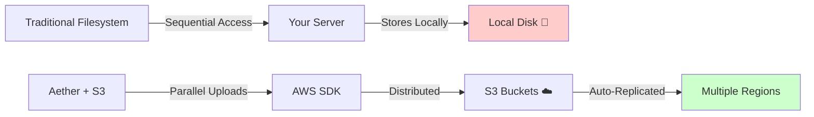
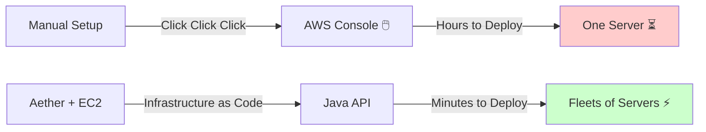
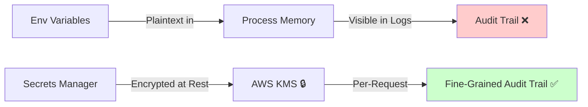

# AWS Provider for Aether

The Aether AWS provider brings unified cloud abstraction to Amazon Web Services, supporting S3 (blob storage), EC2 (compute), and Secrets Manager (secret management). Write once, run on AWS with zero vendor lock-in.

## Overview

| Aether Interface | AWS Service | Purpose |
|---|---|---|
| `BlobStore` | S3 | Object storage for files, images, and data blobs |
| `ComputeEngine` | EC2 | Virtual machine provisioning and lifecycle management |
| `SecretManager` | Secrets Manager | Secure credential and secret storage with rotation |

## Initialization

### Basic Setup

```java
// Create AWS provider with credentials
var provider = new AwsCloudProvider(
    accessKey,           // AWS Access Key ID
    secretKey,           // AWS Secret Access Key
    endpoint,            // Optional: custom endpoint (null for standard AWS)
    region              // AWS region (e.g., "us-east-1")
);

// Initialize the provider
provider.initialize();

// Register with Aether's provider system
DefaultProviderRegistry.instance().register(provider);
```

### Configuration

```
AWS_ACCESS_KEY_ID = "your-access-key"
AWS_SECRET_ACCESS_KEY = "your-secret-key"
AWS_REGION = "us-east-1"
AWS_ENDPOINT = "https://s3.amazonaws.com"  # Optional, for S3-compatible services
```

## Blob Storage (S3)

Store files, images, and large objects in Amazon S3 with automatic multipart handling.

### Upload a Blob

```java
var blobStore = new AwsS3BlobStore(provider);

var uploadRequest = new UploadBlobRequest(
    "my-bucket",                           // Bucket name
    "path/to/file.jpg",                   // Object key
    "image/jpeg",                         // Content type
    inputStream,                          // Data source (InputStream)
    fileSize                              // Size in bytes
);

var metadata = blobStore.upload(uploadRequest);
System.out.println("Uploaded: " + metadata.key() + " (" + metadata.sizeBytes() + " bytes)");
```

### Download a Blob

```java
var ref = new BlobRef("my-bucket", "path/to/file.jpg");
var content = blobStore.download(ref);

// Access the data
byte[] data = content.data().readAllBytes();
System.out.println("Downloaded: " + content.metadata().sizeBytes() + " bytes");
```

### List Blobs with Prefix Filtering

```java
var listRequest = new ListBlobsRequest("my-bucket", "path/to/", null);
var response = blobStore.list(listRequest);

// Iterate results
for (var blob : response.blobs()) {
    System.out.println(blob.key() + " (" + blob.sizeBytes() + " bytes)");
}

// Handle pagination
if (response.hasMore()) {
    var nextPage = blobStore.list(new ListBlobsRequest("my-bucket", "path/to/", response.nextCursor()));
}
```

### Check if Blob Exists

```java
var ref = new BlobRef("my-bucket", "path/to/file.jpg");
boolean exists = blobStore.exists(ref);
System.out.println("File exists: " + exists);
```

### Get Metadata Without Downloading

```java
var ref = new BlobRef("my-bucket", "path/to/file.jpg");
var metadata = blobStore.getMetadata(ref);

System.out.println("Size: " + metadata.sizeBytes());
System.out.println("Type: " + metadata.contentType());
System.out.println("Modified: " + new Date(metadata.lastModifiedMs()));
```

### Delete a Blob

```java
var ref = new BlobRef("my-bucket", "path/to/file.jpg");
blobStore.delete(ref);
System.out.println("Deleted: " + ref.getId());
```

## Compute (EC2)

Provision and manage EC2 instances programmatically.

### Create an Instance

```java
var engine = new AwsEc2ComputeEngine(provider);

var config = new InstanceConfig(
    "web-server-01",                      // Instance name (becomes Name tag)
    "t2.micro",                           // Instance type
    "ami-0c55b159cbfafe1f0",             // AMI ID
    "us-east-1",                          // Region
    Map.of("env", "prod", "team", "backend")  // Tags
);

var instance = engine.createInstance(config);
System.out.println("Created: " + instance.instanceId());
System.out.println("Public IP: " + instance.publicIp());
System.out.println("State: " + instance.state());
```

### List All Instances

```java
var instances = engine.listInstances();
for (var inst : instances) {
    System.out.println(inst.name() + " (" + inst.instanceId() + ") - " + inst.state());
}
```

### Get Instance Details

```java
var instance = engine.getInstance("i-1234567890abcdef0");
System.out.println("Name: " + instance.name());
System.out.println("State: " + instance.state());
System.out.println("Public IP: " + instance.publicIp());
System.out.println("Private IP: " + instance.privateIp());
System.out.println("Tags: " + instance.tags());
```

### Terminate an Instance

```java
engine.terminateInstance("i-1234567890abcdef0");
System.out.println("Instance terminated");
```

### Instance States

Aether maps AWS instance states to a unified enum:

```
PENDING     → Launching
RUNNING     → Fully available
STOPPING    → Shutting down  
STOPPED     → Stopped but not terminated
TERMINATED  → Permanently deleted
UNKNOWN     → State not recognized
```

## Secrets Management

Secure storage for API keys, database passwords, and credentials with automatic versioning.

### Create a Secret

```java
var secretsManager = new AwsSecretsManager(provider);

var metadata = secretsManager.createSecret("db/postgres/password", "super-secret-password");
System.out.println("Created secret: " + metadata.secretId());
System.out.println("Version: " + metadata.versionId());
System.out.println("Created at: " + new Date(metadata.createdAtMs()));
```

### Retrieve a Secret

```java
var secret = secretsManager.getSecret("db/postgres/password");
System.out.println("Password: " + secret.value());
System.out.println("Version: " + secret.versionId());
```

### Update a Secret

```java
var metadata = secretsManager.updateSecret("db/postgres/password", "new-password");
System.out.println("Updated to version: " + metadata.versionId());
System.out.println("Last rotated: " + new Date(metadata.lastRotatedAtMs()));
```

### Rotate a Secret

Rotate generates a new version of the secret while keeping the value the same. **The application is responsible for implementing the actual rotation strategy** (e.g., updating the target system with the new value).

```java
var secret = secretsManager.rotate("db/postgres/password");
System.out.println("New version: " + secret.versionId());
System.out.println("Value (unchanged): " + secret.value());

// Your application now owns the responsibility to:
// 1. Update the database with the new password
// 2. Test the connection
// 3. Monitor for failures
```

### List All Secrets

```java
var secrets = secretsManager.listSecrets();
for (var meta : secrets) {
    System.out.println(meta.secretId() + " (v" + meta.versionId() + ")");
}
```

### Delete a Secret

```java
secretsManager.deleteSecret("db/postgres/password");
System.out.println("Secret deleted");
```

## Exception Handling

All Aether AWS operations throw unchecked `CloudException` and its subclasses:

```java
try {
    var secret = secretsManager.getSecret("missing-secret");
} catch (ResourceNotFoundException e) {
    System.out.println("Secret not found: " + e.getMessage());
} catch (AuthenticationException e) {
    System.out.println("Invalid AWS credentials");
} catch (ProviderUnavailableException e) {
    System.out.println("AWS service temporarily unavailable - " + e.getMessage());
} catch (CloudException e) {
    System.out.println("Unknown error: " + e.getMessage());
}
```

### Exception Hierarchy

```
CloudException (unchecked)
├── ResourceNotFoundException        (404 - not found)
├── AuthenticationException          (401/403 - credentials)
├── ProviderUnavailableException    (503/429 - rate limit or service down)
└── GenericCloudException           (all others)
```

## Architecture Comparison

### S3 vs Traditional File Systems



### EC2 vs Manual Provisioning



### Secrets Manager vs Environment Variables



## Performance Tuning

### S3 Blob Store

- **Multipart Uploads**: AWS SDK automatically chunks large files (default 5MB parts)
- **Batch Operations**: Use pagination cursors to process millions of objects efficiently
- **Transfer Acceleration**: Enabled automatically for applicable regions

### EC2 Compute Engine

- **Instance Type Selection**: `t2.micro` (burstable) vs `m5.large` (consistent) vs `c5.xlarge` (compute-optimized)
- **Lazy Initialization**: Instances take 30-60 seconds to reach RUNNING state
- **Monitoring**: CloudWatch metrics available per instance

### Secrets Manager

- **Caching**: Cache secrets in your application to reduce API calls (versioning ensures freshness)
- **Rotation**: Schedule automatic rotation on a cadence that fits your security requirements
- **Cross-Region**: Replicate secrets to failover regions for high availability

## Troubleshooting

### "Signature does not match" Error

Your AWS credentials are invalid or have expired.

**Solution**: Verify `AWS_ACCESS_KEY_ID` and `AWS_SECRET_ACCESS_KEY` are correct and not rotated.

### "Unable to execute HTTP request" Error

AWS service is temporarily unavailable or your network is down.

**Solution**: Implement exponential backoff retry logic. Aether throws `ProviderUnavailableException` to signal retryable errors.

### "AccessDenied" Error

Your IAM user lacks permissions for the operation.

**Solution**: Ensure your IAM policy includes:
- `s3:GetObject`, `s3:PutObject`, `s3:DeleteObject` for S3
- `ec2:RunInstances`, `ec2:TerminateInstances` for EC2
- `secretsmanager:GetSecretValue`, `secretsmanager:CreateSecret` for Secrets Manager

### Slow List Operations

Listing millions of objects takes time.

**Solution**: Use prefix filtering (`path/to/`) to narrow the scope. S3 returns pages of 1000 objects; use `response.nextCursor()` to iterate.

## See Also

- [Aether Architecture Overview](../architecture.md)
- [Core Interfaces](../core.md)
- [GCP Provider](./gcp.md)
- [Azure Provider](./azure.md)
