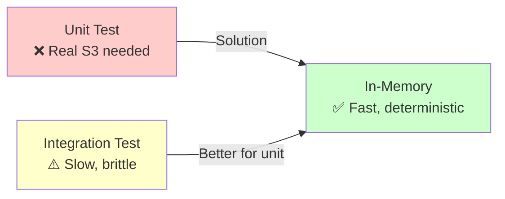

# In-Memory Provider for Aether

The `aether-inmemory` module provides fully in-memory implementations of all Aether services. It is designed for unit tests and local development — no cloud account, no network, no configuration required.

## Why In-Memory?



Think of it like SQLite for cloud services — the same interface as the real thing, but runs entirely in your process with no external dependencies.

## Installation

Add as a test dependency (do not add to production dependencies):

```kotlin
dependencies {
    testImplementation("io.foundry.aether:aether-inmemory:0.1.0")
}
```

## Available Services

| Service | Class | Backed by |
|---|---|---|
| `BlobStore` | `InMemoryBlobStore` | `ConcurrentHashMap<BlobRef, byte[]>` |
| `ComputeEngine` | `InMemoryComputeEngine` | `ConcurrentHashMap<String, InstanceInfo>` |
| `SecretManager` | `InMemorySecretManager` | `ConcurrentHashMap<String, Entry>` |

## Setup

```java
// Create the provider
var provider = new InMemoryCloudProvider();
provider.initialize();

// Create services
var blobStore = new InMemoryBlobStore(provider);
var computeEngine = new InMemoryComputeEngine(provider);
var secretManager = new InMemorySecretManager(provider);
```

That's it. No credentials, no region, no network.

## Using in Tests

### JUnit 5 Example

```java
import io.foundry.aether.inmemory.InMemoryCloudProvider;
import io.foundry.aether.inmemory.storage.InMemoryBlobStore;
import io.foundry.aether.core.storage.*;

class FileServiceTest {

    private BlobStore blobStore;

    @BeforeEach
    void setUp() {
        var provider = new InMemoryCloudProvider();
        provider.initialize();
        blobStore = new InMemoryBlobStore(provider);
    }

    @Test
    void uploadAndDownload_contentMatches() {
        blobStore.upload(UploadBlobRequest.of("bucket", "file.txt", "hello".getBytes(), "text/plain"));

        try (var content = blobStore.download(new BlobRef("bucket", "file.txt"))) {
            assertThat(new String(content.data().readAllBytes())).isEqualTo("hello");
        }
    }

    @Test
    void downloadMissing_throwsResourceNotFoundException() {
        assertThatThrownBy(() -> blobStore.download(new BlobRef("bucket", "missing.txt")))
                .isInstanceOf(ResourceNotFoundException.class);
    }
}
```

### Contract Tests

Aether provides abstract contract tests in `aether-core` that validate all interface semantics. Each provider ships with contract test implementations:

```java
class MyBlobStoreContractTest extends BlobStoreContractTest {

    @Override
    protected BlobStore createBlobStore() {
        return new InMemoryBlobStore(new InMemoryCloudProvider());
    }
}
```

The contract tests verify the full behavioral contract:
- Upload/download content matches
- List with prefix filtering works
- Overwrite replaces existing blobs
- Missing blobs throw `ResourceNotFoundException`
- Delete removes the blob

## Service Details

### InMemoryBlobStore

- **Thread-safe**: All operations use `ConcurrentHashMap`
- **In-process isolation**: Each `InMemoryBlobStore` instance has its own storage
- **No pagination**: `list()` always returns all results (no cursor needed)

```java
var store = new InMemoryBlobStore(provider);

// Upload
store.upload(UploadBlobRequest.of("bucket", "key.txt", "data".getBytes(), "text/plain"));

// Check existence
store.exists(new BlobRef("bucket", "key.txt"));  // true

// List
var response = store.list(new ListBlobsRequest("bucket", "", null));
response.blobs();  // [key.txt]

// Delete
store.delete(new BlobRef("bucket", "key.txt"));
store.exists(new BlobRef("bucket", "key.txt"));  // false
```

### InMemoryComputeEngine

- **Auto-assigns IDs**: Generates `UUID` for each instance
- **Starts in RUNNING state**: `createInstance()` immediately returns a running instance
- **No IP routing**: `publicIp` is always null; `privateIp` is assigned from 10.0.0.x

```java
var engine = new InMemoryComputeEngine(provider);

// Create
var config = new InstanceConfig("web", "t3.micro", "ami-1", "us-east-1", Map.of());
var instance = engine.createInstance(config);
System.out.println(instance.state());      // RUNNING
System.out.println(instance.instanceId()); // uuid

// Terminate
engine.terminateInstance(instance.instanceId());
engine.getInstance(instance.instanceId()).state();  // TERMINATED
```

### InMemorySecretManager

- **Nanosecond versionIds**: Uses `System.nanoTime()` to generate version IDs
- **Strict create/update**: `createSecret()` throws `IllegalStateException` if secret already exists
- **Full rotate support**: `rotate()` bumps versionId without changing the value

```java
var mgr = new InMemorySecretManager(provider);

// Create
mgr.createSecret("db-pass", "s3cr3t!");

// Get
var secret = mgr.getSecret("db-pass");
System.out.println(secret.value());     // s3cr3t!
System.out.println(secret.versionId()); // 8276489273849...

// Rotate (new version, same value)
var rotated = mgr.rotate("db-pass");
System.out.println(rotated.versionId()); // different timestamp

// Delete
mgr.deleteSecret("db-pass");
// mgr.getSecret("db-pass") → throws ResourceNotFoundException
```

## Writing Your Services for Testability

The key to leveraging the in-memory provider is to write your services against the **interface**, not the concrete implementation:

```java
// Good: depends on BlobStore interface
class ImageProcessor {
    private final BlobStore blobStore;  // ← interface

    public ImageProcessor(BlobStore blobStore) {
        this.blobStore = blobStore;
    }

    public void processImage(String bucket, String key) {
        try (var content = blobStore.download(new BlobRef(bucket, key))) {
            // process...
        }
    }
}

// Production: pass AwsS3BlobStore
// Test: pass InMemoryBlobStore
```

## Limitations

The in-memory provider is optimized for correctness in tests, not production-realistic behavior:

| Feature | In-Memory | Real Cloud |
|---|---|---|
| Durability | None — data lost when JVM exits | Persistent |
| Concurrency | Thread-safe within one JVM | Distributed |
| Pagination | Always returns all results at once | Real cursor-based pagination |
| Instance IP | Always null (compute) | Real network IPs |
| Secret versioning | Nanosecond strings | UUIDs from cloud service |
| Encryption | None | At-rest + in-transit encryption |

## See Also

- [Getting Started](../getting-started.md)
- [AWS Provider](./aws.md)
- [NFS Provider (local dev)](./nfs.md)
- [Architecture Overview](../architecture.md)
