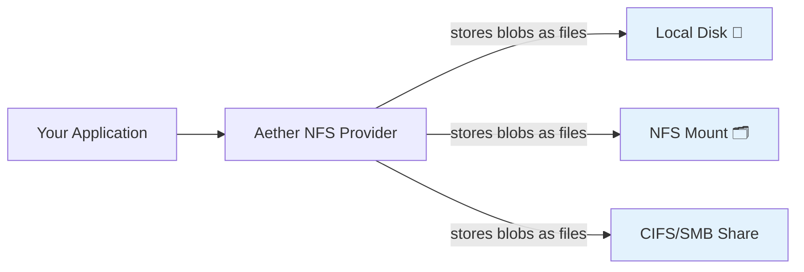
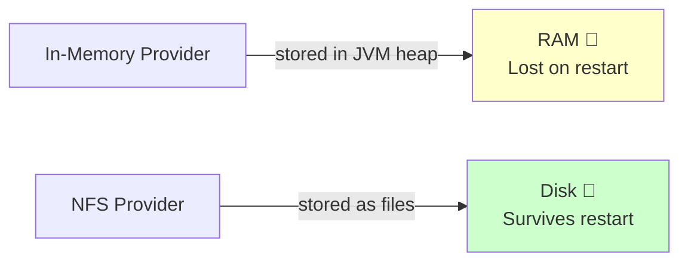

# NFS Provider for Aether

The `aether-nfs` module implements Aether's blob store and secret manager on a local or network filesystem. It's ideal for local development, self-hosted deployments, and environments where cloud credentials are not available.

## What is the NFS Provider?



Files are stored directly on the filesystem. Blobs become actual files. Secrets become pairs of `.value` and `.metadata` files. No database, no daemon, no cloud account needed.

## Installation

```kotlin
dependencies {
    implementation("io.foundry.aether:aether-nfs:0.1.0")
}
```

## Available Services

| Service | Class |
|---|---|
| `BlobStore` | `NFSBlobStore` |
| `SecretManager` | `NFSSecretManager` |

> ComputeEngine is not provided — the NFS provider is for storage and secrets only.

## Setup

```java
// Provide a base path where Aether will store all data
var provider = new NFSCloudProvider("/var/data/aether");
provider.initialize();

// Create services
var blobStore = new NFSBlobStore(provider);
var secretManager = new NFSSecretManager(provider);
```

The base path is created automatically if it doesn't exist.

## Directory Structure

Aether NFS creates a predictable directory layout under your base path:

```
/var/data/aether/
├── my-bucket/                    ← BlobStore bucket
│   ├── uploads/
│   │   ├── photo.jpg
│   │   └── document.pdf
│   └── logs/
│       └── 2026-01-01.log
│
└── .aether-nfs/
    └── secrets/                  ← SecretManager secrets
        ├── db-password.value     ← Secret value (plaintext)
        └── db-password.metadata  ← Secret metadata (JSON)
```

## Blob Store Usage

### Upload a File

```java
var blobStore = new NFSBlobStore(provider);

byte[] data = Files.readAllBytes(Path.of("photo.jpg"));
var request = UploadBlobRequest.of("my-bucket", "uploads/photo.jpg", data, "image/jpeg");
var metadata = blobStore.upload(request);

System.out.println("Stored at: " + metadata.key());
System.out.println("Size: " + metadata.sizeBytes() + " bytes");
```

### Download a File

```java
var ref = new BlobRef("my-bucket", "uploads/photo.jpg");
try (var content = blobStore.download(ref)) {
    Files.copy(content.data(), Path.of("downloaded.jpg"), StandardCopyOption.REPLACE_EXISTING);
}
```

### List Files with Prefix

```java
var request = new ListBlobsRequest("my-bucket", "uploads/", null);
var response = blobStore.list(request);

for (var blob : response.blobs()) {
    System.out.println(blob.key() + " (" + blob.sizeBytes() + " bytes)");
}
```

### Delete a File

```java
var ref = new BlobRef("my-bucket", "uploads/old-photo.jpg");
blobStore.delete(ref);
```

### Check File Exists

```java
boolean exists = blobStore.exists(new BlobRef("my-bucket", "uploads/photo.jpg"));
```

## Secret Manager Usage

Secrets are stored as plaintext files on disk. Use this only in environments where filesystem access is already secured.

### Create a Secret

```java
var manager = new NFSSecretManager(provider);
var metadata = manager.createSecret("database/password", "super-secret");
System.out.println("Stored at version: " + metadata.versionId());
```

This creates two files:
```
.aether-nfs/secrets/database-password.value     ← "super-secret"
.aether-nfs/secrets/database-password.metadata  ← {"secretId":"database/password",...}
```

Note: `/` and other special characters in secret IDs are replaced with `-` in filenames.

### Retrieve a Secret

```java
var secret = manager.getSecret("database/password");
System.out.println(secret.value());     // super-secret
System.out.println(secret.versionId()); // nanosecond timestamp
```

### Update a Secret

```java
var metadata = manager.updateSecret("database/password", "new-password");
System.out.println("Updated to version: " + metadata.versionId());
```

### List All Secrets

```java
var secrets = manager.listSecrets();
for (var meta : secrets) {
    System.out.println(meta.secretId() + " (created: " + meta.createdAtMs() + ")");
}
```

### Delete a Secret

```java
manager.deleteSecret("database/password");
```

## Exception Handling

The NFS provider maps filesystem errors to Aether exceptions:

| Filesystem Error | Aether Exception |
|---|---|
| `NoSuchFileException` | `ResourceNotFoundException` |
| `AccessDeniedException` | `AuthenticationException` |
| `FileSystemException` | `ProviderUnavailableException` |
| Other `IOException` | `GenericCloudException` |

```java
try {
    blobStore.download(new BlobRef("bucket", "missing.txt"));
} catch (ResourceNotFoundException e) {
    System.out.println("File not found on disk: " + e.getMessage());
} catch (AuthenticationException e) {
    System.out.println("Permission denied — check filesystem access");
} catch (ProviderUnavailableException e) {
    System.out.println("Filesystem error: " + e.getMessage());
}
```

## Using in Tests with JUnit 5

```java
class NFSBlobStoreTest extends BlobStoreContractTest {

    @TempDir
    Path tempDir;

    @Override
    protected BlobStore createBlobStore() {
        return new NFSBlobStore(new NFSCloudProvider(tempDir.toString()));
    }
}
```

JUnit's `@TempDir` provides a fresh directory per test — clean, isolated, and automatically deleted after the test completes.

## Comparison to In-Memory Provider



| Aspect | In-Memory | NFS |
|---|---|---|
| **Persistence** | None — lost on JVM exit | Yes — survives restarts |
| **Speed** | Very fast (no I/O) | Filesystem I/O overhead |
| **Inspection** | Cannot inspect stored data | Files are visible on disk |
| **Sharing** | Per-JVM only | Shareable via NFS mounts |
| **Test cleanup** | Automatic | Use `@TempDir` for cleanup |
| **Best for** | Unit tests | Local dev, integration tests |

## Security Considerations

The NFS provider stores secret values as **plaintext files on disk**. This is acceptable for:
- Local development
- Environments where disk encryption (LUKS, FileVault) is in place
- Air-gapped systems without cloud access

It is **not** appropriate for production use if secrets need to be protected at rest. Use the AWS, GCP, or Azure secret manager implementations for production-grade encryption.

## Limitations

- No pagination support (returns all blobs at once)
- Content-type detection uses Java's `Files.probeContentType()` which may return `null` on some platforms
- Concurrent writes to the same key are not atomic (last write wins)
- No bucket creation/deletion (directories are created automatically but not explicitly managed)

## See Also

- [Getting Started](../getting-started.md)
- [In-Memory Provider (unit tests)](./inmemory.md)
- [AWS Provider (production)](./aws.md)
- [Architecture Overview](../architecture.md)
